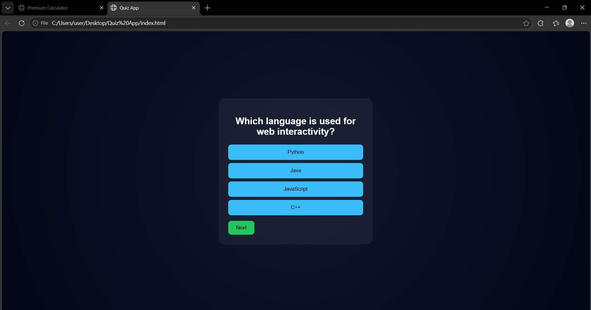

# 🧠 Quiz Game Web Application

An interactive **Quiz Game Application** built using **HTML, CSS, and JavaScript** that displays questions, collects answers, and shows the final score.

---

## 🚀 Features

🎯 **Interactive Quiz**

* Multiple-choice questions
* Dynamic question loading
* One-click answer selection

📊 **Score System**

* Tracks correct answers
* Displays final score at the end

⚡ **User-Friendly UI**

* Clean and modern design
* Smooth button interactions

🔁 **Restart Option**

* Restart quiz anytime after completion

---

## 🛠️ Tech Stack

* **HTML5** – Structure
* **CSS3** – Styling
* **JavaScript (ES6)** – Logic & DOM Manipulation

---

## 📂 Project Structure

```bash
quiz-app/
│── index.html
│── style.css
│── script.js
│── output.png
```

---

## ▶️ How to Run

1. Download or clone the repository
2. Open the project folder
3. Run:

```bash
index.html
```

OR use **Live Server** in VS Code

https://pawanpushkar.github.io/SCT_WD_3/

---

## 📸 Output Preview



---

## 🌟 Future Enhancements

* Timer for each question ⏱️
* Progress bar 📊
* Highlight correct/incorrect answers 🎯
* Multiple question types (MCQ, fill in blanks)
* Save score using localStorage 💾
* Mobile responsive design 📱

---

## 👨‍💻 Author

**Pawan Pushkar**

